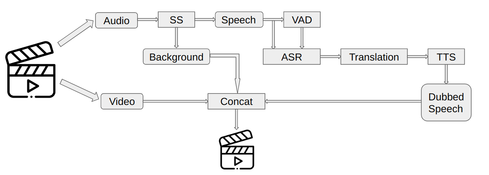

# Overview
This project aims to use various deep learning models to perform automatic dubbing from english to russian language. The general pipeline looks like this:
<p align="center">
</p>

# Installation guide
## Clone this repo:

```shell
git clone https://github.com/wh1tePigeon/AutoDub
```

## Install requirements:

```shell
pip install -r requirements.txt
```
## Download necessary checkpoints:

```shell
python download_checkpoints.py
```

For a quick start [](https://colab.research.google.com/github/wh1tePigeon/AutoDub/blob/master/quickstart.ipynb)
