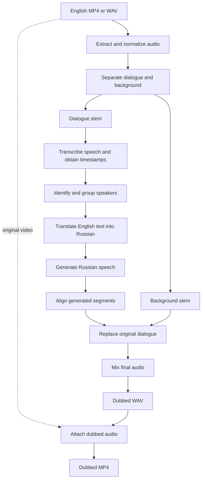

# AutoDub

Deep-learning system for automatic English-to-Russian dubbing of movies, TV episodes, and other video or audio content.

AutoDub combines cinematic source separation, automatic speech recognition, machine translation, speaker diarization, and zero-shot voice cloning in a unified media-processing workflow.

## Contents

- [Project goals](#project-goals)
- [How it works](#how-it-works)
- [Models](#models)
- [Implementation approaches](#implementation-approaches)
- [Installation](#installation)
- [Configuration](#configuration)
- [Running the project](#running-the-project)
- [Outputs](#outputs)
- [Repository structure](#repository-structure)
- [Training components](#training-components)
- [Project results](#project-results)
- [References and acknowledgements](#references-and-acknowledgements)

## Project goals

Professional dubbing normally requires dialogue translation and adaptation, voice acting, audio editing, and synchronization. These stages are expensive and time-consuming, particularly when content must be localized into many languages.

This project automates a substantial part of that workflow. Its primary target is the general case in which:

- the source is an MP4 video or WAV audio file;
- the soundtrack is mono or is treated as mono;
- dialogue is in English;
- speech, music, and sound effects are mixed together;
- subtitles, clean dialogue stems, and speaker labels are unavailable;
- the desired output is Russian speech mixed back with the original background.

The system works directly with mixed soundtracks, making it suitable for media where clean dialogue stems and studio metadata are unavailable.

## How it works

The complete processing workflow is organized as follows:


```mermaid
flowchart TB
    A[English MP4 or WAV]
    A --> B[Extract and normalize audio]
    B --> C[Separate dialogue and background]

    C --> D[Dialogue stem]
    C --> E[Background stem]

    D --> F[Transcribe speech and obtain timestamps]
    F --> G[Identify and group speakers]
    G --> H[Translate English text into Russian]
    H --> I[Generate Russian speech]
    I --> J[Align generated segments]

    J --> K[Replace original dialogue]
    E --> K
    K --> L[Mix final audio]
    L --> M[Dubbed WAV]

    A -. original video .-> N[Attach dubbed audio]
    M --> N
    N --> O[Dubbed MP4]
```

### 1. Media preprocessing

For MP4 input, MoviePy separates the soundtrack from the video stream. Audio is resampled to the rate required by each model and multichannel input is averaged to mono when necessary.

### 2. Cinematic source separation

The main workflow uses a BandIt/Band-Split RNN model trained for cinematic audio separation. It estimates a dialogue stem and derives a background stem containing music, ambience, and sound effects.

This is related to the *cocktail fork problem*: unlike conventional speech enhancement or music demixing, cinematic separation must distinguish dialogue, music, and sound effects in complex real-world soundtracks.

### 3. Speech recognition and segmentation

OpenAI Whisper (`small.en` by default) transcribes the separated dialogue and produces utterance-level timestamps. The repository also supports a modular speech-processing approach based on SpeechBrain VAD followed by DeepSpeech2 or Whisper.

Intermediate transcriptions are stored as semicolon-separated CSV files with segment IDs, start times, end times, and text.

### 4. Speaker diarization

Each speech segment is converted into an ECAPA-TDNN speaker embedding using SpeechBrain's `spkrec-ecapa-voxceleb` model. Similar embeddings are grouped into speaker labels, and segments assigned to the same speaker are concatenated to provide a longer voice reference for synthesis.

### 5. Offline translation

The default configuration uses [Helsinki-NLP/opus-mt-en-ru](https://huggingface.co/Helsinki-NLP/opus-mt-en-ru) to translate English segments into Russian. Once model files are cached, this stage can run offline. The translation module also supports Google Translate.

### 6. Voice cloning and speech generation

Coqui XTTS synthesizes each Russian utterance using:

- the corresponding original English segment; and
- the combined reference audio for the detected speaker.

The two XTTS conditioning representations are averaged before inference. This approach is intended to preserve speaker identity while improving short utterances with additional reference speech.

### 7. Alignment and final mix

Generated speech is time-stretched to fit the original segment boundaries, inserted into the dialogue stem, and mixed with the separated background. For video input, the resulting WAV track is attached to the original video stream.

## Models

### BandIt / Band-Split RNN

BandIt is the primary cinematic source-separation model. Its Band-Split RNN architecture divides a spectrogram into frequency bands, models temporal and spectral relationships within those bands, and predicts masks for dialogue, music, and effects. AutoDub uses the estimated speech stem for recognition and voice references while preserving the remaining audio as background.

### CascadedNet

CascadedNet is an alternative lightweight separator derived from the Vocal Remover project. It applies a sequence of spectrogram-processing stages to estimate vocal and accompaniment components. In AutoDub it provides another approach to extracting dialogue before speech recognition.

### OpenAI Whisper

Whisper is a Transformer-based encoder-decoder model trained on large-scale multilingual audio data. AutoDub uses its English models to recognize dialogue and obtain timestamped speech segments in a single stage. The model size is configurable, allowing users to choose the desired balance of inference speed and recognition capacity.

### DeepSpeech2

DeepSpeech2 is an end-to-end speech-recognition architecture built from convolutional and recurrent layers with Connectionist Temporal Classification. The repository includes its model, text encoders, CTC loss, decoding utilities, and training pipeline. It can process segments produced by voice activity detection.

### SpeechBrain VAD

The SpeechBrain voice activity detector identifies speech regions and produces temporal boundaries for subsequent recognition. This supports a modular approach in which segmentation and transcription are performed by separate models.

### SpeechBrain ECAPA-TDNN

ECAPA-TDNN produces fixed-size embeddings that encode speaker-specific voice characteristics. AutoDub extracts one embedding per utterance and groups related segments by speaker so that XTTS can use longer, speaker-consistent reference audio.

### OPUS-MT

`Helsinki-NLP/opus-mt-en-ru` is a Transformer-based neural machine translation model trained on OPUS parallel corpora. It translates recognized English dialogue into Russian and stores the result alongside timestamps and speaker labels.

### Coqui XTTS

XTTS is a multilingual text-to-speech model with zero-shot voice cloning. It conditions generation on short reference recordings, allowing Russian speech to retain characteristics of the source speaker. AutoDub supports both per-segment conditioning and speaker-level conditioning assembled from multiple utterances.

### MP-SENet

The repository also contains MP-SENet speech-enhancement components. The model jointly estimates magnitude and phase information to improve noisy speech representations and can be used as an additional audio-cleaning stage.

## Implementation approaches

AutoDub includes several interchangeable approaches for individual dubbing stages:

- **Source separation:** BandIt/BSRNN for cinematic multi-stem separation or CascadedNet for vocal-oriented separation.
- **Speech segmentation and recognition:** full-recording Whisper with timestamps, or SpeechBrain VAD followed by DeepSpeech2 or segment-based Whisper.
- **Translation:** local OPUS-MT inference or Google Translate.
- **Speaker conditioning:** each utterance can be used as its own XTTS reference, or utterances can first be grouped by speaker to create a shared reference.
- **Output generation:** audio input produces a dubbed WAV file, while video input preserves the video stream and attaches the generated soundtrack.

These components share intermediate WAV and semicolon-separated CSV artifacts, so stages can be configured and combined independently.

## Installation

Clone the repository:

```bash
git clone https://github.com/wh1tePigeon/AutoDub
cd AutoDub
```

Install the dependencies:

```bash
pip install -r requirements.txt
```

## Configuration

Hydra configuration files are stored in `source/configs`.

- `source/configs/dub.yaml` configures the VAD-based approach.
- `source/configs/dub_v2.yaml` configures the diarization-aware approach.
- Subdirectories under `source/configs` define model, dataset, optimizer, scheduler, loss, preprocessing, and trainer settings.

All paths containing `$ROOT` are resolved against the current working directory, so commands should be run from the repository root.

### Input path

Both top-level scripts currently define a non-empty `FILEPATH` constant near the top of the file. That value overrides Hydra's `filepath` setting.

To process your own file, either:

1. edit `FILEPATH` in `dub.py` or `dub_baseline.py`; or
2. set `FILEPATH = ""` and set `filepath` in the corresponding YAML file.

The orchestration scripts accept lowercase `.mp4` and `.wav` extensions. The repository includes `input/test.mp4` and `input/test2.mp4` as sample media.

### Important pipeline settings

In `source/configs/dub_v2.yaml`:

- `bsrnn.sr`: separation sample rate, currently 44,100 Hz;
- `bsrnn.max_len`: maximum direct-inference chunk length;
- `asr_wtime.model`: Whisper model, currently `small.en`;
- `tr.use`: `opusmt` or `google`;
- `cut.save_segments`: save individual speaker segments;
- `cut.save_common`: save concatenated per-speaker references;
- `concatenate.join_video`: set automatically for MP4 input.

## Running the project

From the repository root:

```bash
# VAD-based approach
python dub_baseline.py

# Diarization-aware approach
python dub.py
```

Hydra creates a run directory, while model artifacts are written to the repository's configured `output` directories.

Individual inference modules can also be run and integrated independently. Their function-level input and output contracts are summarized in `docs/main.md`.

## Outputs

Each stage preserves intermediate files to make the pipeline inspectable and reusable. The default layout is:

```text
output/
├── video_n_audio_separated/  # extracted WAV and silent video
├── bsrnn/                    # separated dialogue and background stems
├── vad/                      # VAD speech boundaries
├── asr/                      # transcripts and timestamps
├── label/                    # diarization labels
├── translated/               # Russian translations
├── cutted/                   # utterance and per-speaker reference WAV files
├── tts/                      # synthesized Russian segments
├── aligned_audio/            # duration-aligned segments
└── final/                    # final WAV and, for MP4 input, final video
```

Most metadata files are UTF-8, semicolon-separated CSV files. As the pipeline progresses, columns such as `start`, `end`, `text`, `label`, `translation`, `path`, `path_to_common`, `tts_path`, and `aligned_tts` are added.

The final files are named approximately:

```text
output/final/<name>/<name>_final_audio.wav
output/final/<name>/<name>_final_video.mp4
```

## Repository structure

```text
AutoDub/
├── README.md
├── LICENSE
├── requirements.txt
├── download_checkpoints.py       # Google Drive checkpoint downloader
├── dub_baseline.py               # VAD-based orchestration script
├── dub.py                        # diarization-aware orchestration script
├── docs/
│   ├── main.md                   # inference function reference
│   └── quickstart.ipynb          # minimal notebook workflow
└── source/
    ├── augmentations/            # waveform and spectrogram augmentation
    ├── base/                     # shared model, dataset, metric, trainer APIs
    ├── configs/                  # Hydra pipeline and training configuration
    ├── datasets/                 # LibriSpeech, Common Voice, DNR, and others
    ├── inference/
    │   ├── asr/                  # DeepSpeech2 and Whisper inference
    │   ├── bsrnn/                # BandIt/BSRNN separation
    │   ├── cascaded/             # vocal-remover separation
    │   ├── diarize/              # embeddings and speaker clustering
    │   ├── speech_enhancement/   # MP-SENet inference
    │   ├── translate/            # Google Translate and OPUS-MT
    │   ├── tts/                  # XTTS synthesis
    │   └── vad/                  # SpeechBrain VAD
    ├── logger/                   # console, TensorBoard, and W&B helpers
    ├── loss/                     # CTC and source-separation losses
    ├── metric/                   # CER, WER, and SNR metrics
    ├── model/                    # DS2, CascadedNet, BSRNN, and MP-SENet
    ├── text_encoder/             # character and CTC text encoders
    ├── train_model/              # model-specific training entry points
    ├── trainer/                  # training loops
    └── utils/                    # media, audio, data, and path utilities
```

## Training components

In addition to the dubbing pipeline, the repository contains training infrastructure inherited from and adapted from [pytorch-template](https://github.com/victoresque/pytorch-template).

Available entry points include:

```bash
python source/train_model/train_ds2.py
python source/train_model/train_cascaded.py
python source/train_model/train_bsrnn.py
```

Training behavior is controlled by the corresponding configuration trees under `source/configs/asr`, `source/configs/cascaded`, and `source/configs/bsrnn`. Dataset and checkpoint paths can be selected in the Hydra configuration for each model.

## Project results

The combination of specialized models provides a complete English-to-Russian media-localization workflow:

- BandIt performs cinematic dialogue extraction in soundtracks containing speech, music, ambience, and effects.
- Whisper combines transcription and timestamp generation in one inference stage.
- OPUS-MT enables local English-to-Russian translation after model files are downloaded.
- Speaker-aware reference preparation gives XTTS additional voice context for speech synthesis.
- Duration alignment preserves the timing of the original utterances.
- Intermediate stems, transcripts, translations, speaker labels, and generated segments remain available for inspection and reuse.

The repository also includes utilities for processing MKV media containing original and dubbed multichannel audio and subtitle streams. These assets can be transformed into data for source-separation training, speech segmentation, translation, speaker verification, and actor-specific speech synthesis.

Users are responsible for obtaining permission to process source media and to clone or synthesize a person's voice. Generated media should be disclosed where appropriate and must comply with applicable copyright, privacy, and personality-rights laws.

## References and acknowledgements

This repository is a heavily modified fork of [pytorch-template](https://github.com/victoresque/pytorch-template).

Below are key external projects and papers used:

- Watcharasupat, K., Tran, C., Towsey, M., & Williamson, A. (2024). "A Generalized Bandsplit Neural Network for Cinematic Audio Source Separation." *IEEE Open Journal of Signal Processing*. [[code]](https://github.com/kwatcharasupat/bandit) [[paper]](https://doi.org/10.1109/OJSP.2023.3339428)
- Radford, A., et al. "Robust Speech Recognition via Large-Scale Weak Supervision." [[code]](https://github.com/openai/whisper) [[paper]](https://arxiv.org/abs/2212.04356)
- Ravanelli, M., et al. "SpeechBrain: A General-Purpose Speech Toolkit." [[code]](https://github.com/speechbrain/speechbrain) [[paper]](https://arxiv.org/abs/2106.04624)
- Coqui TTS & XTTS: Multilingual zero-shot voice cloning. [[code]](https://github.com/coqui-ai/TTS)
- Tiedemann, J. & Thottingal, S. "OPUS-MT — Building Open Translation Services for the World." [[code]](https://github.com/Helsinki-NLP/Opus-MT)
- Tsurumeso, K. "Vocal Remover." (CascadedNet separator) [[code]](https://github.com/tsurumeso/vocal-remover)
- Amodei, D., et al. "Deep Speech 2: End-to-End Speech Recognition in English and Mandarin." [[paper]](https://arxiv.org/abs/1512.02595)
- Petermann, J., et al. "Cocktail Fork Problem." [[paper]](https://arxiv.org/abs/2008.04470)

## License

This project is distributed under the [MIT License](LICENSE).
